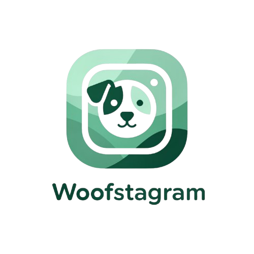
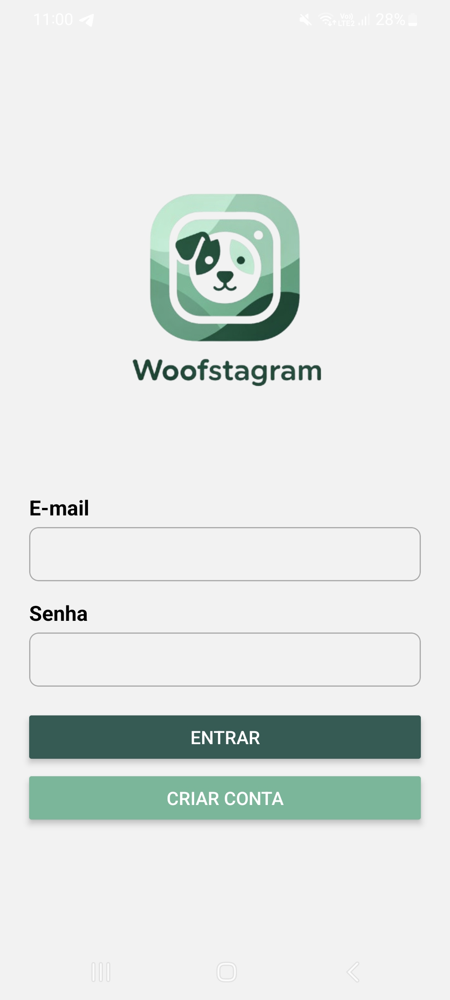
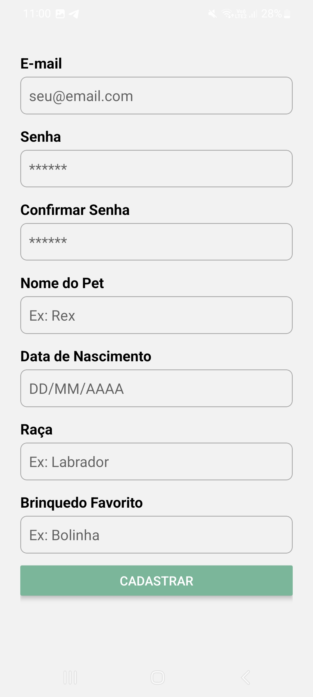

  

  <h1 align="center">Projeto Unidade 2, TDGI - 4° Semestre</h1>

    Desenvolvimento do WoofStagram, aplicativo React Native estilo instagram de pets, para avaliação da disciplina de Tecnologia de Desenvolvimento de Interface Gráfica.
     
    <a href="https://youtube.com/shorts/6k32msp-JOs?si=TWRt4fv-pAE3h6yb"><strong>Vídeo Demo»</strong></a>
      

  
  
  

### Integrantes

- [Letícia Barbosa M. da Cruz](https://github.com/daCruzZzLeticia)

## Projeto Desenvolvido

### Formulário de Cadastro de Pets

Implementação do fluxo de cadastro de pets em **React Native**, com foco em **componentes reutilizáveis, controle de estado com `useState`, validação de senha, responsividade com `ScrollView` e organização do formulário com Formik**.

  
  

 

**Arquivos relacionados:** [`SignUpScreen.jsx`](/screens/SignUpScreen.jsx), [`InputField.jsx`](/components/InputField.jsx) ;

(<a href="#readme-topo">voltar ao topo</a>)

